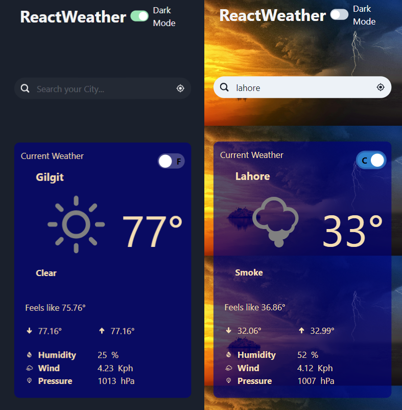
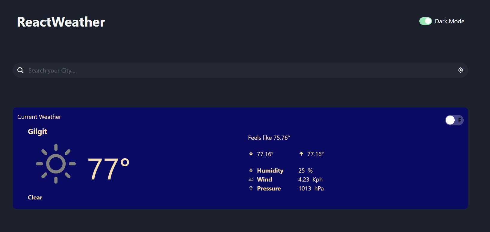

# Weather Dashboard

A modern, responsive weather dashboard built with React, TypeScript, and Vite.

## Features

- Real-time weather information
- Search for weather by city
- Display of current weather conditions
- Forecast for the next few days
- Responsive design for mobile and desktop
- Dark and light theme support

## Technologies Used

- React
- TypeScript
- Vite
- ESLint for code quality
- CSS for styling (possibly using a CSS-in-JS solution or a CSS framework)

## Screenshots

### Mobile View

#### Dark/Light Theme


### Desktop View



## Getting Started

1. Clone the repository:
   ```git clone https://github.com/Muawaz/weather-dashboard.git```
2. Install dependencies:
  ```cd weather-dashboard```
   ```npm install```
3. Run the development server:
   ```npm run dev```
4. Open your browser and navigate to `http://localhost:5173` (or the port specified by Vite).

## Build

To build the project for production:
   ```npm run build```
## Linting

To run the linter:
   ```npm run lint```

## Configuration

The project uses the following configuration files:

- `tsconfig.json`: TypeScript configuration
- `tsconfig.node.json`: TypeScript configuration for Node.js
- `vite.config.ts`: Vite configuration
- `eslint.config.js`: ESLint configuration

## Contributing

Contributions are welcome! Please feel free to submit a Pull Request.
